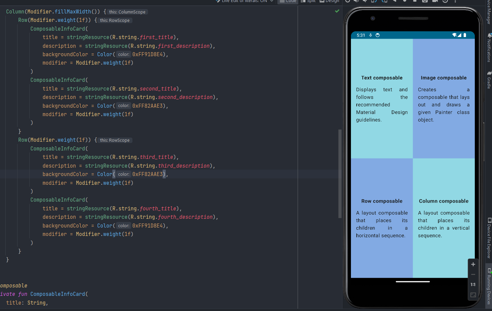

#  Exercise number 3 Learning compose with Kotlin

Este es un proyecto de ejemplo de Jetpack Compose utilizando Kotlin. Estoy aprendiendo desarrollo móvil y he creado este proyecto como parte de mi proceso de aprendizaje. El objetivo es tener un registro de mis inicios y poder ver mi progreso a medida que avanzo en mi carrera como desarrollador móvil.

## Descripción del Proyecto

Este proyecto muestra un artículo utilizando Jetpack Compose. El artículo se compone de cuatro títulos y cuatro descripciones. Utiliza Material Design y se adapta automáticamente al tema del dispositivo.

## Capturas de Pantalla

Aquí hay una vista previa de cómo se ve el artículo en la aplicación:

## Configuración del Proyecto

1. Clona el repositorio:

2. Importa el proyecto en tu IDE preferido (Android Studio, IntelliJ, etc.).

3. Ejecuta la aplicación en un dispositivo o emulador Android.

## Contribuir

Si deseas contribuir a este proyecto, eres bienvenido/a. Puedes abrir un issue para discutir nuevas características, mejoras o problemas, o enviar una solicitud de pull con tus cambios propuestos.

## Recursos de Aprendizaje

Aquí hay algunos recursos que me han sido útiles mientras aprendo Jetpack Compose. Tambien cabe destacar que esta practica la hago en conjunto al codelab gratis en developer android!:

- [Documentación oficial de Jetpack Compose](https://developer.android.com/jetpack/compose)
- [Codelabs de Jetpack Compose](https://developer.android.com/courses/pathways/compose)
- [Developer Android](https://developer.android.com/?hl=es-419)

¡Gracias por revisar mi proyecto! Espero que encuentres útil este ejemplo de Jetpack Compose. Si tienes alguna pregunta o sugerencia, no dudes en contactarme.
